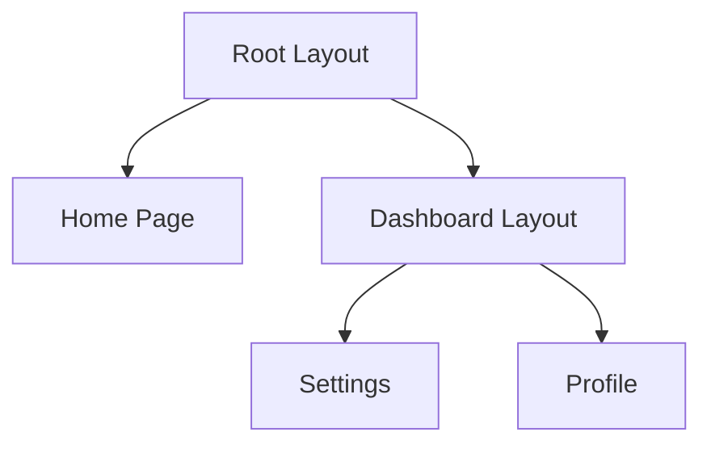
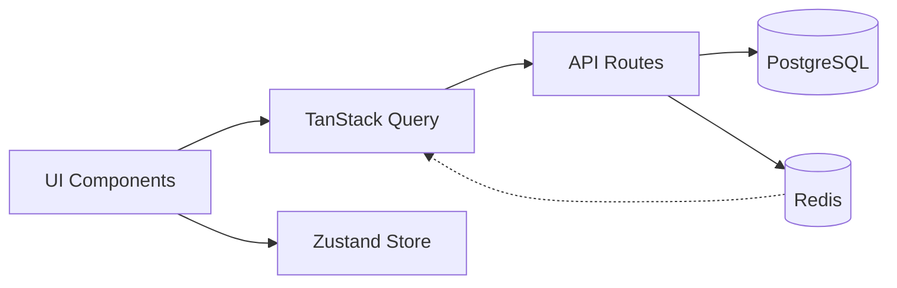
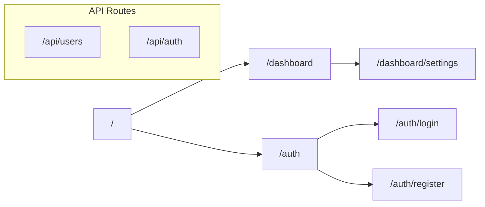
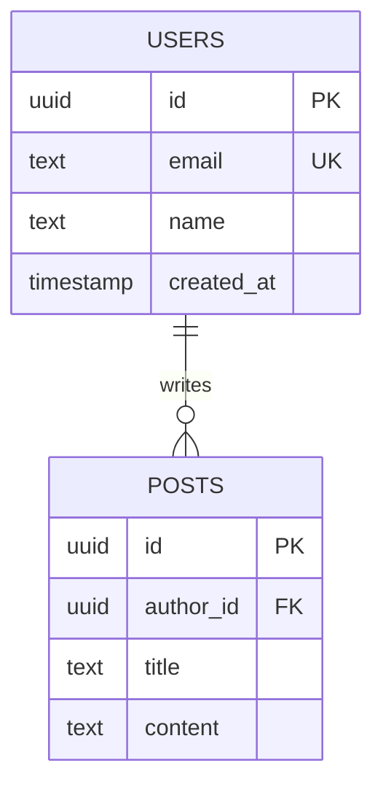
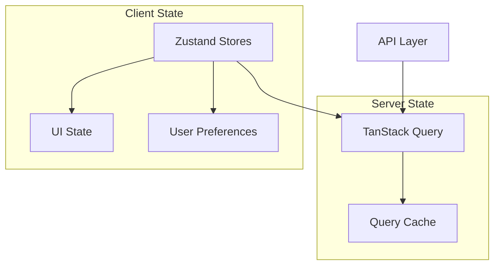

# Define Architecture

Generates comprehensive architecture documentation for a project by scanning the codebase and producing Mermaid diagrams, ADRs (Architecture Decision Records), and a README index.

## Usage

```
/define-architecture
```

## Instructions

### Step 1: Scan Codebase Structure

Map the project's structure:

```bash
# Identify framework and entry points
ls package.json pyproject.toml Cargo.toml go.mod 2>/dev/null

# Map directory structure (top 3 levels)
find . -maxdepth 3 -type d \
  -not -path '*/node_modules/*' \
  -not -path '*/.git/*' \
  -not -path '*/.next/*' \
  -not -path '*/dist/*' \
  -not -path '*/__pycache__/*'
```

### Step 2: Identify Components

For each area, scan and document:

**Routes & Pages** (Next.js / web frameworks):
```bash
# Find all route files
find app -name "page.tsx" -o -name "route.ts" -o -name "layout.tsx" 2>/dev/null
```

**API Layer:**
```bash
# Find API routes and handlers
find . -path "*/api/*" -name "*.ts" -o -name "*.py" 2>/dev/null | head -50
```

**Database Schema:**
```bash
# Find schema definitions
find . -name "schema.ts" -o -name "models.py" -o -name "*.prisma" 2>/dev/null
```

**State Management:**
```bash
# Find stores and state files
find . -name "*store*" -o -name "*state*" -o -name "*context*" 2>/dev/null | grep -v node_modules
```

**Shared Libraries:**
```bash
# Find lib/utils directories
find . -path "*/lib/*" -o -path "*/utils/*" -o -path "*/helpers/*" 2>/dev/null | grep -v node_modules | head -30
```

### Step 3: Generate Mermaid Diagrams

Create `docs/architecture/` directory and generate:

**`docs/architecture/component-hierarchy.md`**
```markdown
# Component Hierarchy



Document the component tree from layout → pages → key components.
```

**`docs/architecture/data-flow.md`**
```markdown
# Data Flow



Show how data moves: UI → API → Database → Cache → back to UI.
```

**`docs/architecture/route-map.md`**
```markdown
# Route Map



Map all pages and API routes.
```

**`docs/architecture/database-erd.md`**
```markdown
# Database ERD



Generate from schema files.
```

**`docs/architecture/state-management.md`**
```markdown
# State Management



Document which state lives where.
```

### Step 4: Generate Architecture Decision Records

Create `docs/architecture/decisions/` directory. For each significant architectural choice detected:

**Template: `docs/architecture/decisions/ADR-001-[title].md`**
```markdown
# ADR-001: [Decision Title]

**Status:** Accepted
**Date:** [Date detected]
**Context:** [What prompted this decision]

## Decision

[What was decided and why]

## Consequences

### Positive
- [benefit]

### Negative
- [tradeoff]

### Neutral
- [observation]
```

Common ADRs to generate:
- Framework choice (Next.js 16, etc.)
- State management approach
- Database ORM choice
- Authentication strategy
- Caching strategy
- Testing strategy

### Step 5: Create README Index

Create `docs/architecture/README.md`:
```markdown
# Architecture Documentation

## Diagrams
- [Component Hierarchy](./component-hierarchy.md) — UI component tree
- [Data Flow](./data-flow.md) — How data moves through the system
- [Route Map](./route-map.md) — Pages and API routes
- [Database ERD](./database-erd.md) — Database schema relationships
- [State Management](./state-management.md) — Client and server state

## Architecture Decision Records
- [ADR-001: Title](./decisions/ADR-001-title.md)
- [ADR-002: Title](./decisions/ADR-002-title.md)

## Maintenance
These docs are maintained by the agent pipeline. When modifying system
structure, agents MUST update the relevant diagrams. UPDATE existing
diagrams — never just append.

*Last generated: [timestamp]*
```

### Step 6: Create init.sh Bootstrap Script

Generate `.issue/init.sh` for the project:

```bash
#!/bin/bash
# Project bootstrap script — run at start of each pipeline session
set -euo pipefail

PROJECT_DIR="$(cd "$(dirname "${BASH_SOURCE[0]}")/.." && pwd)"
cd "$PROJECT_DIR"

echo "=== Bootstrapping project ==="

# Install dependencies if needed
if [ -f "package.json" ]; then
  if [ ! -d "node_modules" ]; then
    echo "Installing dependencies..."
    npm install
  fi
fi

# Start dev server if not running (Next.js)
if [ -f "next.config.ts" ] || [ -f "next.config.js" ]; then
  if ! pgrep -f "next dev" > /dev/null 2>&1; then
    echo "Starting dev server..."
    npm run dev &
    # Wait for server to be ready
    timeout 60 bash -c 'until curl -sf http://localhost:3000 > /dev/null 2>&1; do sleep 2; done' || echo "Warning: dev server did not start in 60s"
  else
    echo "Dev server already running"
  fi
fi

# Run smoke test
echo "Running smoke test..."
if [ -f "package.json" ]; then
  npm run type-check 2>&1 || echo "Warning: type-check had issues"
fi

echo "=== Bootstrap complete ==="
```

### Step 7: Report

```
## Architecture Documentation Generated

**Location:** docs/architecture/

**Diagrams:**
- Component hierarchy
- Data flow
- Route map
- Database ERD
- State management

**ADRs:** [count] decisions documented
**Init script:** .issue/init.sh created

**Next steps:**
- Review generated docs for accuracy
- Agents will update these docs as architecture changes
```

## Critical Rules

1. **Scan before generating** — Base all diagrams on actual code, not assumptions
2. **Mermaid syntax** — Validate diagram syntax is correct
3. **UPDATE, not append** — When docs exist, update them rather than creating new ones
4. **ADRs are permanent** — Once created, ADRs are updated with new status, never deleted
5. **init.sh is executable** — Set chmod +x on the bootstrap script
6. **Keep diagrams focused** — Each diagram covers one aspect, not everything
